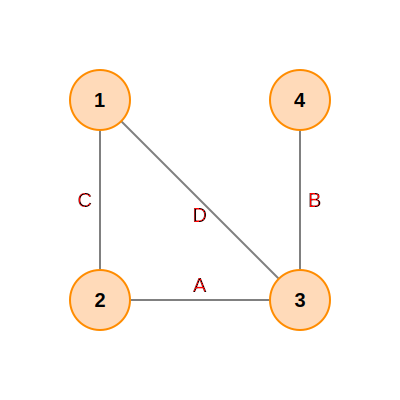

# Graph algorithm for max disjoint pairs

## Problem Statement

We have a regular graph with edges of positive weights. We can assume that
weights are integers.

If that can influence the solution, we can also assume that number of edges `M`
is `M ~ C*N`, where `N` is the number of nodes and `C` is some constant.

The goal is to break the graph into disjoint pairs or singles of nodes such that
the sum of the weights of the links connecting the pairs is maximized. The
output graph should not contain incident edges, and it should have the maximum
sum of edge weights.

For example, for a graph with nodes `1,2,3,4` and edges:
```text
A: 2,3
B: 3,4
C: 1,2
D: 1,3
```



If `wA = 3` and `wB = wC = wD = 1`, then the max-weight output is `A:2,3; 1; 4`
with total weight `wA = 3`.

If `wA = 3` and `wB = wC = wD = 2`, then the max-weight output is
`B:3,4; C:1,2` with total weight `wB + wC = 4`.

**Is there an efficient algorithm for this problem?**
Yes — This Is Maximum Weight Matching

Yes, there is an efficient algorithm for this problem. This is the Maximum
Weight Matching problem, specifically for finding a maximum weight matching in a
general graph. It can be solved efficiently using Edmond's Blossom Algorithm
(also known as the Edmonds-Gallai decomposition), which runs in polynomial time
`O(n³)` or `O(n²m)` depending on the implementation, where `n` is the number of
nodes and `m` is the number of edges.

The problem described is the classical Maximum Weight Matching problem on a
general (non-bipartite) graph. The goal is to select a set of edges with no two
sharing a node (a "matching") such that the total edge weight is maximized.

Efficient Algorithm: Edmond's Blossom Algorithm (Jack Edmonds, 1965, also known
as the Edmonds-Gallai decomposition) solves this in polynomial time. The
weighted generalization runs in:
- `O(n³)` for general graphs
- `O(nm log n)` for sparse graphs (which applies here since `m ~ C·n`)

How It Works (High Level):
1. Start with an empty matching.
2. Repeatedly find augmenting paths — paths that alternate between non-matching
   and matching edges, starting and ending at unmatched nodes.
3. The key complication for general (non-bipartite) graphs is handling
   odd-length cycles ("blossoms"), which the algorithm contracts and then
   expands.
4. Weights are handled via dual variables (from LP duality), ensuring
   optimality.

Practical Options:
- Python/NetworkX: networkx.max_weight_matching(G) — implements Galil, Micali &
  Gabow's algorithm
- Blossom V: A fast C++ implementation by Kolmogorov
- SciPy: scipy.sparse.csgraph has related matching utilities

Example Verification

For the above example with `wA=3, wB=wC=wD=1`:
- Matching `{A}` gives weight 3; matching `{B,C}` gives weight 2. → Algorithm
  picks `{A}`.

For `wA=3, wB=wC=wD=2`:
- Matching `{A}` gives weight 3; matching `{B,C}` gives weight 4. → Algorithm
  picks `{B,C}`.
