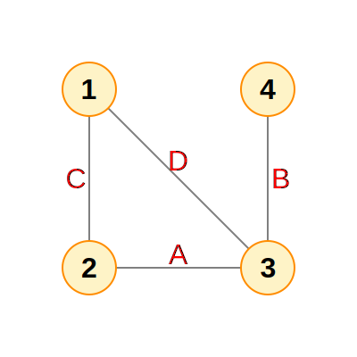
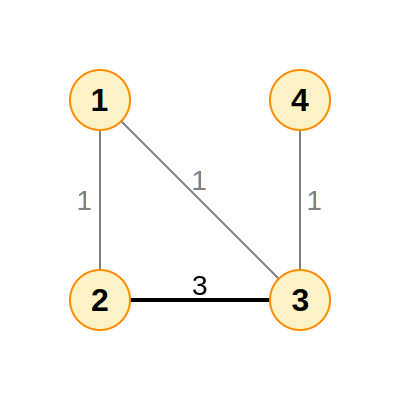
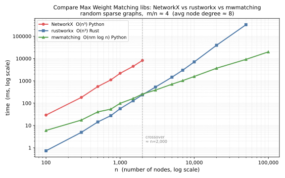

# Graph algorithms for max weight disjoint pairs

## Problem Statement

We have a regular graph with `n` nodes and `m` edges with positive weights. We
can assume that weights are integers.

If that can influence the solution, we can also assume that `m ~ C*n`, where `C`
is some constant. I.e., the graph is sparse.

The goal is to break the graph into disjoint pairs or singles of nodes such that
the sum of the weights of the links connecting the pairs is maximized. The
output graph should not contain incident edges, and it should have the maximum
sum of edge weights.

For example, for a graph with nodes `1,2,3,4` and edges:
```text
A: 2,3
B: 3,4
C: 1,2
D: 1,3
```



If `wA = 3` and `wB = wC = wD = 1`, then the max-weight output is `A:2,3; 1; 4`
with total weight `wA = 3`.



If `wA = 3` and `wB = wC = wD = 2`, then the max-weight output is
`B:3,4; C:1,2` with total weight `wB + wC = 4`.


**Is there an efficient algorithm for this problem?**
The problem described is the classical Maximum Weight Matching problem on a
general (non-bipartite) graph. The goal is to select a set of edges with no two
sharing a node (a "matching") such that the total edge weight is maximized.

Efficient Algorithm: Edmond's Blossom Algorithm (Jack Edmonds, 1965, also known
as the Edmonds-Gallai decomposition) solves this in polynomial time. The
weighted generalization runs in:
- `O(n³)` for general graphs
- `O(nm log n)` for sparse graphs (which applies here since `m ~ C·n`)

How It Works (High Level):
1. Start with an empty matching.
2. Repeatedly find augmenting paths — paths that alternate between non-matching
   and matching edges, starting and ending at unmatched nodes.
3. The key complication for general (non-bipartite) graphs is handling
   odd-length cycles ("blossoms"), which the algorithm contracts and then
   expands.
4. Weights are handled via dual variables (from LP duality), ensuring
   optimality.

For the above example with `wA=3, wB=wC=wD=1`:
- Matching `{A}` gives weight 3; matching `{B,C}` gives weight 2. → Algorithm
  picks `{A}`.

For `wA=3, wB=wC=wD=2`:
- Matching `{A}` gives weight 3; matching `{B,C}` gives weight 4. → Algorithm
  picks `{B,C}`.

## Complexity Landscape

```text
┌─────────────┬───────────────────────────────────────┐
│ Complexity  │             Applicable to             │
├─────────────┼───────────────────────────────────────┤
│ O(n³)       │ Dense and sparse graphs (classic)     │ Edmonds' blossom + primal-dual
├─────────────┼───────────────────────────────────────┤
│ O(nm log n) │ Sparse graphs (theoretically optimal) │ Galil, Micali & Gabow
└─────────────┴───────────────────────────────────────┘
```
For `m ~ C·n` (sparse), `O(nm log n) = O(n² log n)`, which is much better than
`O(n³)`.

### References

The first polynomial time algorithm for maximum matching was found by
Edmonds [1] and subsequently improved by Gabow and others [2][3][4][5].
Currently, known algorithms can find maximum weighted matchings for dense graphs
in time `O(n^3)`. For sparse graphs, there are faster algorithms that run within
`O(nm log n)` [4][5].

**O(n³) — Edmonds' Blossom Algorithm**

- [1] Edmonds, J. (1965). "Paths, Trees, and Flowers."
  _Canadian Journal of Mathematics_, 17, 449–467.
  [Cambridge Core](https://www.cambridge.org/core/journals/canadian-journal-of-mathematics/article/paths-trees-and-flowers/08B492B72322C4130AE800C0610E0E21)
  - [PDF (U. Michigan)](https://web.eecs.umich.edu/~pettie/matching/Edmonds-paths-trees-flowers.pdf)
  - The first polynomial-time algorithm for maximum matching in general graphs,
    introducing the O(n⁴) blossom algorithm.

- [2] Gabow, H. N. (1973). "Implementation of Algorithms for Maximum Matching on
  Nonbipartite Graphs." Ph.D. thesis, Stanford University.
  [Stanford SearchWorks](https://searchworks.stanford.edu/view/2168982)
  - [ACM](https://dl.acm.org/doi/abs/10.5555/906555)
  - physical copy only, no free PDF; see [3] for the derived journal paper
  - reduces time from O(n⁴) to O(n³)

- [3] Gabow, H. N. (1976). "An Efficient Implementation of Edmonds' Algorithm
  for Maximum Matching on Graphs."
  _Journal of the ACM_, 23(2), 221–234.
  [ACM](https://dl.acm.org/doi/10.1145/321941.321942)
  - journal version of the thesis

**O(nm log n) — Galil, Micali & Gabow**

- [4] Galil, Z., Micali, S., & Gabow, H. (1986). "An O(EV log V) Algorithm for
  Finding a Maximal Weighted Matching in General Graphs."
  _SIAM Journal on Computing_, 15(1), 120–130.
  [SIAM](https://epubs.siam.org/doi/10.1137/0215009)
  - [PDF (U. Michigan)](https://web.eecs.umich.edu/~pettie/matching/Galil-Micali-Gabow-EVlogV-Matching.pdf)
  - original O(nm log n) paper

- [5] Gabow, H. N. (2018). "Data Structures for Weighted Matching and Extensions
  to b-matching and f-factors."
  _ACM Transactions on Algorithms_, 14(3).
  [ACM](https://dl.acm.org/doi/10.1145/3183369)
  - [PDF (arXiv)](https://arxiv.org/abs/1611.07541)
  - modern authoritative description; proves O(n(m + n log n)) for general
    graphs

**Surveys and good descriptions**

- [6] Galil, Z. (1986). "Efficient Algorithms for Finding Maximum Matching in
  Graphs." _ACM Computing Surveys_, 18(1), 23–38.
  [ACM](https://dl.acm.org/doi/10.1145/6462.6502)
  - [PDF (ACM open access)](https://dl.acm.org/doi/pdf/10.1145/6462.6502)
  - accessible survey covering both O(n³) and O(nm log n) algorithms

- [7] Mehlhorn, K., & Schäfer, G. (2002). "Implementation of O(nm log n)
  Weighted Matchings in General Graphs: The Power of Data Structures."
  _ACM Journal of Experimental Algorithmics_, 7.
  [ACM](https://dl.acm.org/doi/abs/10.1145/944618.944622)
  - [PDF (MPI-INF)](https://people.mpi-inf.mpg.de/~mehlhorn/ftp/WeightedMatchings.pdf)
  - practical implementation guide for O(nm log n)

## Libraries

### O(n³) — Easy to install, actively maintained

**[NetworkX](https://networkx.org/)** `networkx.max_weight_matching()`
([docs](https://networkx.org/documentation/stable/reference/algorithms/generated/networkx.algorithms.matching.max_weight_matching.html))
- Pure Python, Edmonds' blossom + primal-dual O(n³) algorithm
- Uses exact integer arithmetic when all weights are integers
- Slow for large graphs due to Python overhead
- `pip install networkx`

**[rustworkx](https://www.rustworkx.org/)** `rustworkx.max_weight_matching()`
([docs](https://www.rustworkx.org/apiref/rustworkx.max_weight_matching.html),
[GitHub](https://github.com/Qiskit/rustworkx))
- Rust port of NetworkX library (same O(n³) algorithm for MWM)
- ~10–50x faster than NetworkX in practice due to Rust backend
- IBM/Qiskit project
- `pip install rustworkx`

### O(nm log n) — Theoretically optimal for sparse graphs

**[mwmatching](https://git.jorisvr.nl/joris/maximum-weight-matching)**
([article](https://jorisvr.nl/article/maximum-matching))
- Van Rantwijk's
  v3 <https://git.jorisvr.nl/joris/maximum-weight-matching/src/tag/v3>
- The only accessible Python implementation of the true O(nm log n) algorithm
- Self-contained Python package (no external dependencies), also ships C++
  header
- Not on PyPI — installed as a uv editable workspace member (see below)

Installing mwmatching with uv:

Clone the repo once to a local path:
```bash
git clone https://git.jorisvr.nl/joris/maximum-weight-matching \
    /path/to/maximum-weight-matching
```

Create a child `pyproject.toml` in your scripts folder (e.g.
`docs/notes/graph/script/`):
```toml
[project]
name = "graph-matching"
version = "0.1.0"
requires-python = ">=3.14"
dependencies = ["mwmatching", ...]

[tool.uv.sources]
mwmatching = { path = "/path/to/maximum-weight-matching/python", editable = true }
```

Register it as a workspace member in the root `pyproject.toml`:
```toml
[tool.uv.workspace]
members = ["docs/notes/graph/script"]
```

Then install:
```bash
uv sync --all-packages
```

After this, `import mwmatching` works in any `uv run` script and the import
resolves directly to the cloned source. `uv sync` alone only installs the root
project's dependencies; `--all-packages` is required to also install workspace
members' dependencies.

**[LEMON](https://lemon.cs.elte.hu/trac/lemon)** (C++ only, no usable Python
bindings)
([matching API](http://lemon.cs.elte.hu/pub/doc/latest-svn/a00852.html))
- Production-quality O(nm log n) `MaxWeightedMatching` for general graphs
- Reference C++ implementation, part of COIN-OR project
- [pylemon](https://pylemon.readthedocs.io/en/latest/)
  (v0.0.3, stale since 2022) and [cylemon](https://github.com/cstraehl/cylemon)
  ("very partial" Cython) exist but neither exposes general graph max weight
  matching usably

### Specialized / Not applicable

Both Blossom V and PyMatching solve **minimum-cost perfect matching** (every
node must be paired, no singles). This differs from our problem in two ways: we
want maximum weight (not minimum cost), and we allow singles (non-perfect).
Despite this, Blossom V *can* solve our problem via a standard reduction: add
dummy nodes with zero-weight edges to absorb unmatched nodes and negate weights
to convert max → min.

**[Blossom V](https://pub.ista.ac.at/~vnk/papers/blossom5.pdf)**
(Kolmogorov, C++)
- Solves min-weight perfect matching on **general graphs**
- Applicable via reduction (see above), but no official Python package
- License prohibits embedding in other libraries

**[PyMatching](https://pymatching.readthedocs.io/en/latest/)**
([GitHub](https://github.com/oscarhiggott/PyMatching), [PyPI](https://pypi.org/project/PyMatching/))
- Solves min-weight perfect matching on **restricted graph topologies** only
  (designed for quantum error correction surface codes)
- Cannot be repurposed for general graphs — not applicable

### Summary table

| Library                                                                            | Complexity      | General graph | Max weight              | Python  | pip install | Status   |
|------------------------------------------------------------------------------------|-----------------|---------------|-------------------------|---------|-------------|----------|
| [Van Rantwijk v3](https://git.jorisvr.nl/joris/maximum-weight-matching/src/tag/v3) | O(nm log n)     | yes           | yes                     | yes     | manual      | active   |
| [LEMON](https://lemon.cs.elte.hu/trac/lemon) + pylemon                             | O(nm log n)     | yes           | yes                     | partial | yes         | stale    |
| [rustworkx](https://www.rustworkx.org/)                                            | O(n³)           | yes           | yes                     | yes     | yes         | active   |
| [NetworkX](https://networkx.org/)                                                  | O(n³)           | yes           | yes                     | yes     | yes         | active   |
| [Blossom V](https://pub.ista.ac.at/~vnk/papers/blossom5.pdf)                       | O(n(m+n log n)) | yes           | min-weight perfect only | no      | no          | C++ only |
| [PyMatching](https://pymatching.readthedocs.io/en/latest/)                         | near-linear     | special       | min-weight perfect only | yes     | yes         | active   |

## Benchmarks: NetworkX vs rustworkx vs mwmatching

Compare NetworkX (`nx`), rustworkx (`rx`), and mwmatching (`mw`) libraries.

Measured on macOS, Python 3.14, random sparse graphs generated with avg edges
per node ≈ 4 (`m ~ 4n`). Scripts in `docs/notes/graph/script/`.

**Key gotcha:** rustworkx `max_weight_matching` requires `weight_fn=lambda x: x`
— without it the library silently uses weight=1 for every edge and returns wrong
results.

### All three libraries (n up to 2,000)

|     n |     m | nx (ms) | rx (ms) | mw (ms) | nx/rx | nx/mw |                rx/mw |
|------:|------:|--------:|--------:|--------:|------:|------:|---------------------:|
|   100 |   386 |      46 |     1.2 |      10 |   38x |    4x |                 0.1x |
|   300 | 1,189 |     283 |     7.5 |      27 |   38x |   10x |                 0.3x |
|   500 | 1,983 |     850 |      22 |      67 |   38x |   13x |                 0.4x |
|   750 | 2,980 |   1,901 |      49 |      97 |   39x |   20x |                 0.5x |
| 1,000 | 3,984 |   3,532 |      89 |     150 |   40x |   24x |                 0.6x |
| 1,500 | 5,977 |   8,345 |     248 |     337 |   34x |   25x |                 0.7x |
| 2,000 | 7,982 |  13,804 |     398 |     363 |   35x |   38x | **1.1x** ← crossover |

### rustworkx vs mwmatching (n up to 10,000)

|      n |      m | rx (ms) | mw (ms) | rx/mw |
|-------:|-------:|--------:|--------:|------:|
|  1,000 |  3,984 |      90 |     144 |  0.6x |
|  2,000 |  7,982 |     384 |     347 |  1.1x |
|  3,000 | 11,984 |     842 |     562 |  1.5x |
|  5,000 | 19,981 |   2,497 |   1,052 |  2.4x |
|  7,000 | 27,974 |   4,970 |   1,437 |  3.5x |
| 10,000 | 39,982 |  15,345 |   2,859 |  5.4x |

### rustworkx vs mwmatching — large scale

|       n |       m | rx (ms) | mw (ms) | rx/mw |
|--------:|--------:|--------:|--------:|------:|
|  10,000 |  39,982 |   7,049 |   1,571 |  4.5x |
|  20,000 |  79,979 |  39,312 |   3,675 | 10.7x |
|  50,000 | 199,983 | 329,027 |   9,173 | 35.9x |
| 100,000 | 399,976 |       — |  19,876 |     — |

### Plot of the combined benchmark data



### Conclusions

- **rustworkx** is ~35x faster than NetworkX at all sizes (same O(n³) algorithm,
  Rust vs pure Python)
- **Crossover at n ≈ 2,000**: mwmatching overtakes rustworkx there due to its
  superior O(nm log n) complexity
- At n=50,000, mwmatching is **35x faster** than rustworkx; rustworkx takes
  ~5 min while mwmatching finishes in ~9 sec
- For sparse graphs at scale, mwmatching (van Rantwijk v3) is the clear choice
